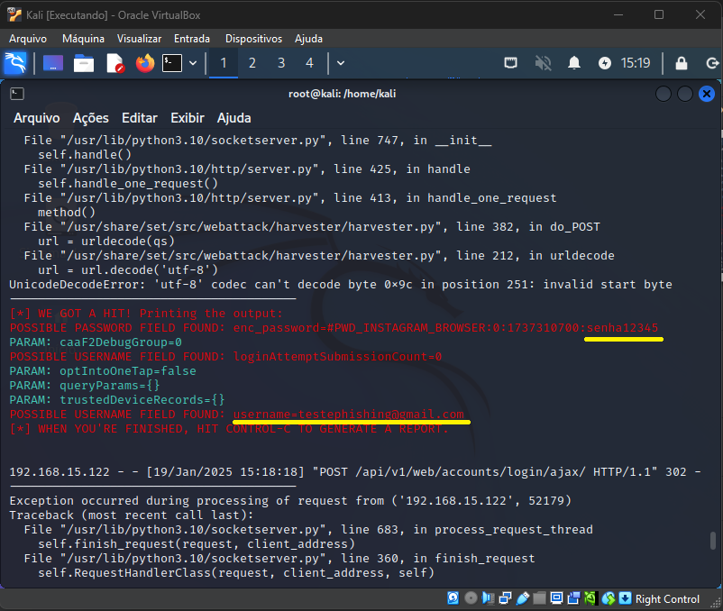

# Phishing para captura de senhas do Instagram

### Ferramentas

- Kali Linux
- setoolkit

### Observações

Caso apresente erro na imagem disponibilizada diretamente do site da Kali Linux, utilize a .ISO do repositório do professor. A imagem do repositório do professor está funcionando normalmente e não apresentou erro no setoolkit.

### Configurando o Phishing no Kali Linux

- Acesso root: ``` sudo su ```
- Iniciando o setoolkit: ``` setoolkit ```
- Tipo de ataque: ``` Social-Engineering Attacks ```
- Vetor de ataque: ``` Web Site Attack Vectors ```
- Método de ataque: ```Credential Harvester Attack Method ```
- Método de ataque: ``` Site Cloner ```
- Obtendo o endereço da máquina: ``` ifconfig ```
- URL para clone: http://www.instagram.com

### Resutados


